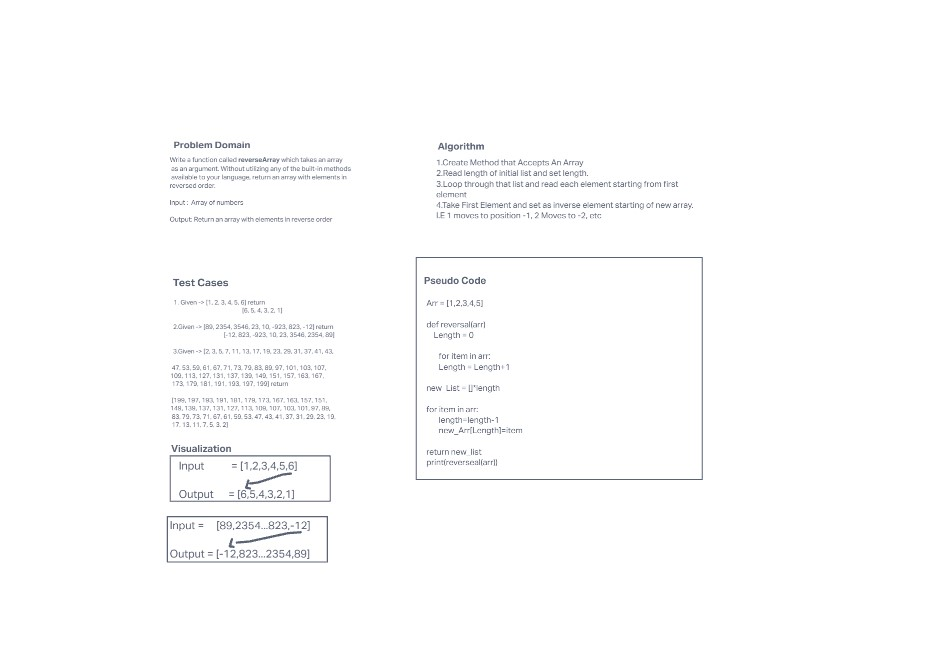

# Anthony's Whiteboard Code Challenges

## Code Challenge 1- Reverse Array

I have to whiteboard out my process for reversing an array, including psuedocode.

Challenge: Reverse elements in an array

Example : [1,2,3,4,5] becomes [5,4,3,2,1]

## Whiteboard Process

## Approach and Efficency

I took this whiteboard as serious as I would take a project. I spoke with my collaborator  Pedro Perez . We talked through it TOGETHER, speaking about why we were doing things this way, offering constructive criticism and inout as we worked. 

This code is very simple but not very elegent, there is a built in method that could do this much simplier. This does its job, but isnt very efficent. Its slower then it should be. 
