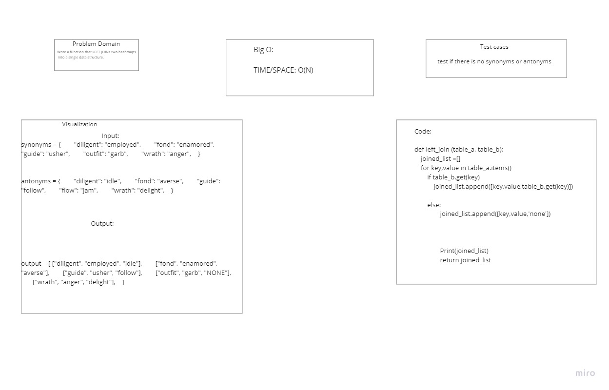

# Code Challenge 32

## Hashtable-Left-Join

### Challenge Summary
Write a function that takes in two hashtables and returns a list that has the values from each passed in hashtable.

### Whiteboard process

### Approach and Efficiency
Big O Time: O(N) where N is the number of items in the hashtable
Big O Space: O(N) where N is the number of values appended to the list

### Solution
1. Take in 2 hashmaps
2. Create an empty list
3. Loop through table_a items
4. use the get method from the hashtable data structure to check if table_b has a value that is associated with table_a's key
5. if yes then append(key, value_a, and value_b)
6. if no then append(key, value_a, and 'NONE')
7. return list that was appended to!
