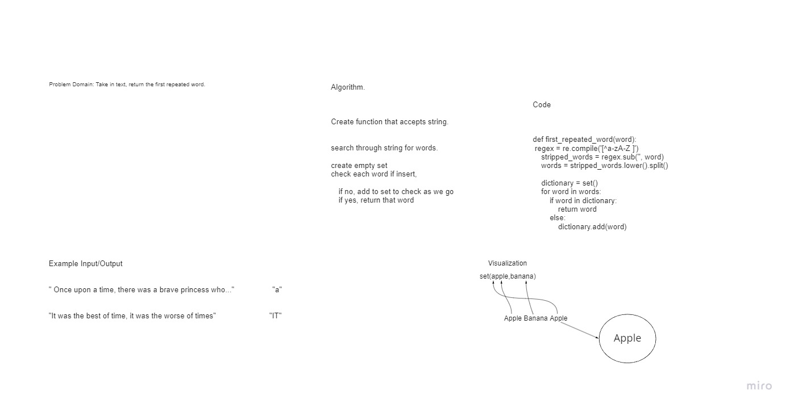

# Code Challenge 31

## Hashtables Repeated word.

### Challenge Summary
 Create a function called  first repeated word that finds the first word to repeat itself in a string.

### Whiteboard

## Approach and Efficiency

The TIem /Space is O(N) N is the  number of words in the string.

### How to solve (solution)

1. Create a Function that accepts a string
2. Search through string for words
3. Create empty set
4. check to see if each word is in a set, if not, add to the set, if so return the word, because that is a repeat

