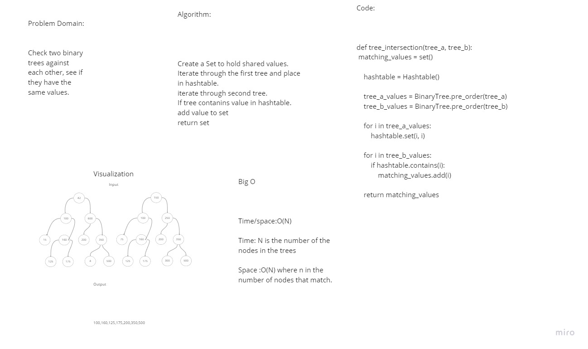

## Code Challenge 32

### Tree Intersection

### Collaboration

Worked with Jacon amsbury on it
### Whiteboard

### Approach and Efficiency

Time/space:O(N)

Time: N is the number of the nodes in the trees

Space :O(N) where n in the number of nodes that match.

### Solution

Create a set to hold shared values
Iterate through the first tree and put values into a hashtable
iterate through the second tree and compare values to hashtable using the contains method
if value is in hashtable then put value into set
return set
