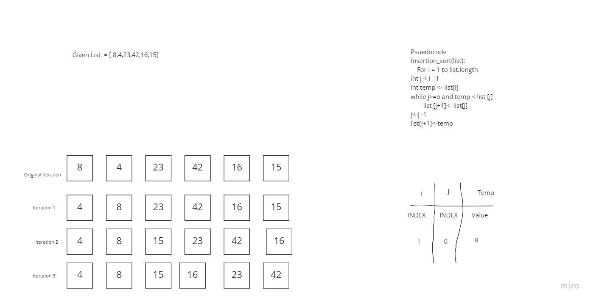

# Blog Notes: Insertion Sort

## Anthony's Insertion blog notes

Hello everyone, My name is Anthony Hill. And i'm here to  teach you all insertion sorting.

### How does it work?
* First look at the list one element by one element at a time. meaning the first iteration will already be sorted. Not much to do, so lets move on
* Select the following element and compare it to each of the values that preceded it, compairing the values of the elements.
* If the element's value is larger then we swap positions of the elements (the one we are looking at)
* when we get to the start of the list, of the number before it is no longer larger than it, we'll move to the next element.
* Continute this line of logic until all numbers have been checked.

### Code Example
```


def insertion_sort(list):
  for i in range(len(list)):
    j = i -1
    temp = list[i]

    while j >= 0 and temp < list[j]:
      list[j+1] = list[j]
      j -= 1

    list[j+1] = temp

  return list


```
 Now that you've seen a code example and a minor explanation , lets give you a big snapshot in progress to show you it in an image.


### Visualization




## Big O

Time: 0(n^2)

Space 0(N)


### Summary

That is a simple overview of the concept of insertion sorting.
If this helps, please let me know.


